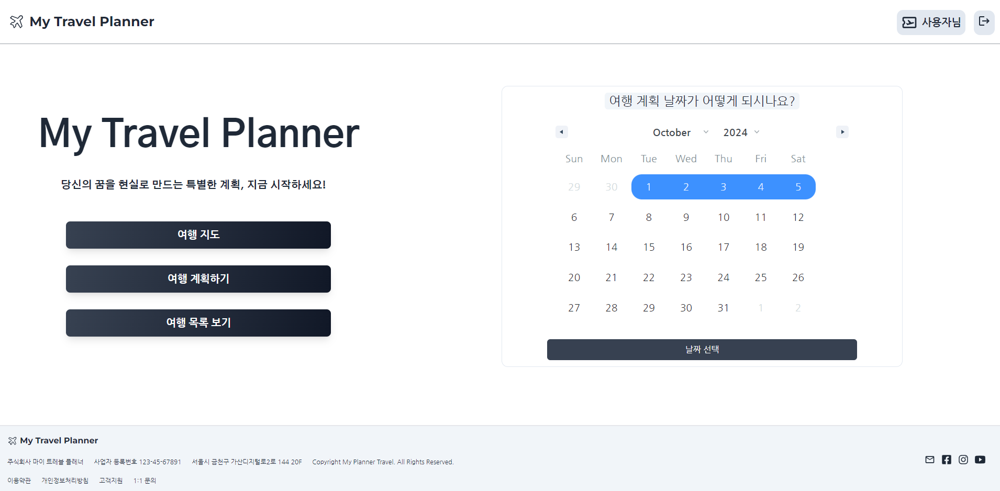
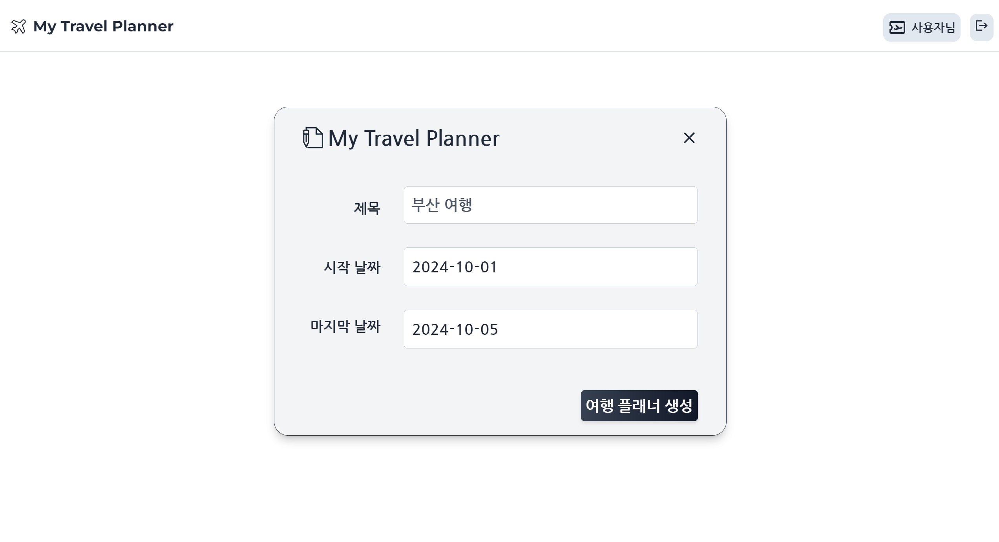
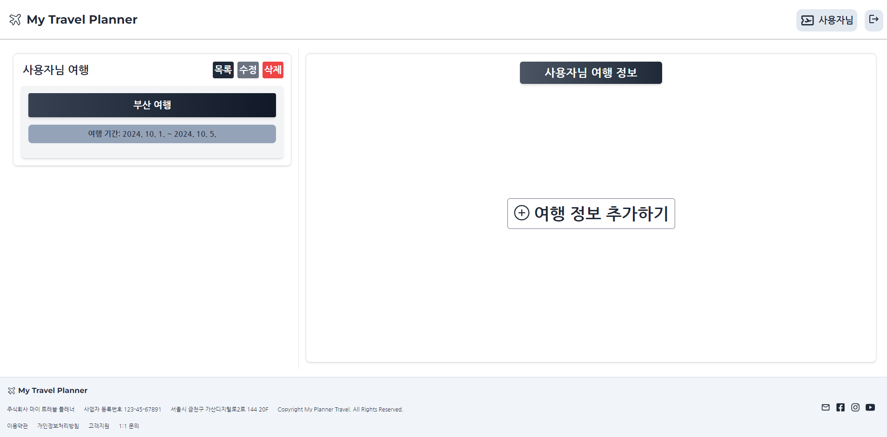
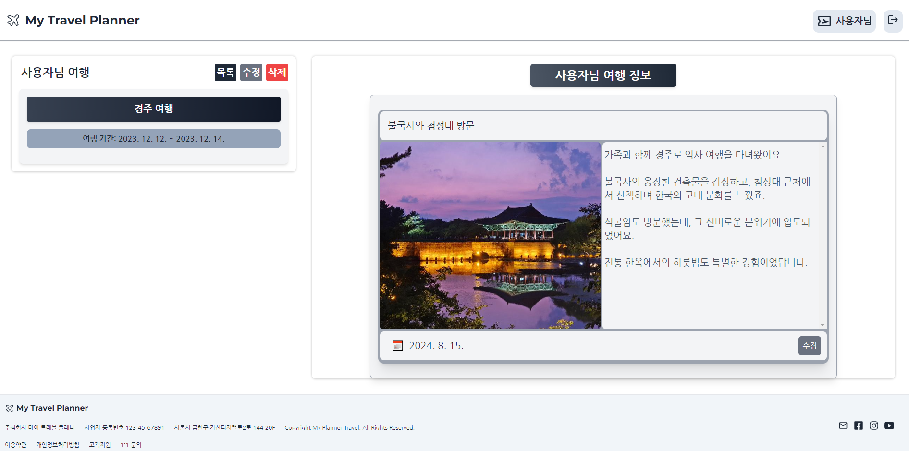
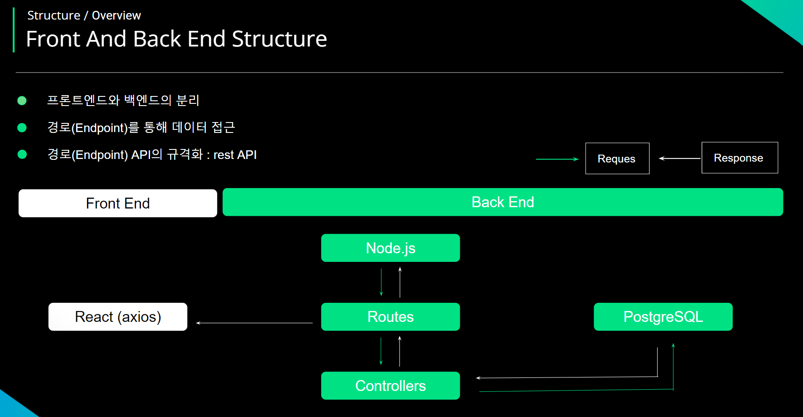

# CRM Service Project 

### My Travel Planner

<p align="center">
  
</p>


# 1. 프로젝트 소개 & 목적


### 프로젝트 소개
  
  *  AI를 통해 여행 계획을 작성하는 웹은 있습니다.
  
  
  *  사용자가 달력으로 여행 날짜, 장소, 정보 작성 하는 웹은 없습니다.
  

  * 여행 계획 뿐만 아니라 사용자가 방문했던 장소를 사진을 등록하고 여행 정보를 작성 할 수 있는 시스템


### 프로젝트 목적

  * 구글 지도 제공하여 로드맵 확인 가능


  * 일정 계획을 통해 캘린더에서 날짜를 선택하여 목록 생성


  * 여행 장소를 시 우측에 내가 적었던 여행 정보 표현, 수정 및 삭제 가능


# 2. 개발 환경


### 기술 스택  


* Back (Node.js) & DB (Postgresql)


```
* NPM Package : EXPRESS, CORS, DOTENV, NODEMON, PG

# Backend Project Structure

## 📂 Project Structure
├── 📁 data
│   ├── 📁 database
│   │   └── 🗃️ database.js
│   └── 📄 sampleData.json
│
├── 📁 routes
│   ├── 🛣️ calendarRoutes.js
│   └── 🛣️ userRoutes.js
│
├── 📁 uploads
│   └── 📁 images
│
├── 📄 index.js
├── 📄 README.md
└── 📄 package.json

## 🚀 API Endpoints
├── POST /post_calendar
├── GET /get_travel_data/:user_idx/:project_idx
└── GET /get_user_data/:user_id

## 🔧 Configuration
├── 🔑 Environment Variables
│   └── .env
├── 📄 Middleware
│   └── authMiddleware.js
└── 📄 Error Handling
    └── errorHandler.js

* DB : Postgresql 

## 📦 users
├── 👤 user_idx: SERIAL PRIMARY KEY        -- 자동 증가하는 기본 키
├── 📝 name: VARCHAR(100) NOT NULL         -- 사용자 이름
├── 📧 email: VARCHAR(100) UNIQUE NOT NULL  -- 사용자 이메일 
└── 🔒 password: VARCHAR(100) NOT NULL      -- 사용자 비밀번호

## 📦 travel_project
├── 🗂️ project_idx: SERIAL PRIMARY KEY      -- 자동 증가하는 기본 키
├── 🔗 user_idx: INT                        -- 사용자 테이블과 조인 컬럼 
├── 📅 project_title: VARCHAR(255)          -- 프로젝트 제목
├── 🕒 project_date: TIMESTAMP NOT NULL DEFAULT CURRENT_TIMESTAMP  -- 프로젝트 생성일
├── 🗓️ start_date: DATE NOT NULL            -- 프로젝트 시작일
├── 🗓️ end_date: DATE NOT NULL              -- 프로젝트 종료일
├── 🛠️ update_date: TIMESTAMP NOT NULL DEFAULT CURRENT_TIMESTAMP  -- 프로젝트 업데이트 날짜
├── 📚 planner_title: VARCHAR(255)          -- 플래너 제목
├── 📜 planner_description: TEXT             -- 플래너 설명
├── 📅 planner_date: DATE                    -- 플래너 생성일
├── 🕒 planner_update_date: TIMESTAMP NOT NULL DEFAULT CURRENT_TIMESTAMP  -- 플래너 업데이트 날짜
└── 🖼️ planner_img: TEXT                     -- 플래너 이미지 URL 또는 경로
```


# 3.  구현 기능


### 캘린더


<p align="center">
  
</p>


### 날짜 선택


<p align="center">
  
</p>


* 달력에서 날짜를 선택 - End Point POST (node.js) 를 통해 user_idx, startDate, endDate DB에 저장


```
POST /post_calendar
Content-Type: application/json

{
  "user_idx": 1,
  "startDate": "2024-10-01",
  "endDate": "2024-10-07"
}
```


* POST - BODY ( user의 id와 여행 시작 날짜, 끝 날짜 )
* front (react) => back (node.js) => DB (postgresql)에 저장


### 여행 목록 생성

* 화면이 이동하여 여행 목록 생성되어 여행 시작 날짜와 끝 날짜 표현


<p align="center">
  
</p>


```
GET /get_calendar_data/:user_idx

[
  {
    "project_idx": 1,
    "start_date": "2024-09-01",
    "end_date": "2024-09-10"
  }
]
```

* GET -  생성된 여행 프로젝트 ID, 여행 시작 날짜, 끝 날짜 데이터
* DB (postgresql) <=> BACK (Node.js) => FRONT (React) GET 요청


### 여행 목록 생성 완료


<p align="center">
  
</p>

```
PATCH /update_planner_title

{
"project_title" : "부산 여행",
"project_idx" : 1 
}
```

* PATCH -  생성된 여행 프로젝트 ID, 여행 Title update
* front (react) <=> back (node.js) => DB (postgresql) UPDATE 요청


### 여행 정보 작성 후 생성


<p align="center">
  
</p>

```
GET /get_travel_data/:user_idx

{
"project_idx": 73,
"project_title": "경주 여행",
"start_date": "2023-12-12T00:00:00.000Z",
"end_date": "2023-12-14T00:00:00.000Z",
"planner_title": "불국사와 첨성대 방문",
"planner_description": "가족과 함께 경주로 역사 여행을 다녀왔어요 ~",
"planner_date": "2024-08-15T00:00:00.000Z",
"planner_img": "http://plannerback.guswldaiccproject.com/uploads/1726711358045.jpg"
}
```

* GET -  생성된 여행 프로젝트 ID, 여행 TITLE, 여행 시작 날짜, 끝 날짜, 여행 플래너 title, 내용, 작성 날짜, 이미지
* DB (postgresql) <=> BACK (Node.js) => FRONT (React) GET 요청

# 4. 배포

### Front & Back Flow

<p align="center">
  
</p>

### Back (Node.js)

```
# 📦 Back - Node.js Deploy
├── 📂 aws
│   ├── 🖥️ ec2
│   │   ├── 📄 nginx.conf
│   │   ├── ⚙️ pm2
│   │   └── 🏃‍♂️ actions-runner
│   ├── 🔒 인증서
│   │   └── 📄 SSL 인증서 (https)
│   ├── 🌐 route53
│   │   └── 📄 도메인 설정 파일 (origin)
│   └── ☁️ cloudfront
│       └── 📄 CDN 설정 파일
│
├── 📂 github
│   ├── 🤖 runner
│   │   └── 📄 self-hosted-runner 설정
│   ├── 🌿 env
│   │   └── 📄 환경 변수 (database, login secret key 등)
│   └── 🟢 node.js
│       └── 📄 config.js (Node.js 관련 환경 설정 파일)
│
└── 📄 README.md
```

# 5. 트러블 슈팅


### DB NOT NULL ERROR


* 처음 POST 할 user_idx, start_date, end_date 외 NOT NULL 값 제외 


```

## 📦 travel_project
├── 🗂️ project_idx: SERIAL PRIMARY KEY      -- 자동 증가하는 기본 키
├── 🔗 user_idx: INT                        -- 사용자 테이블과 조인 컬럼 
├── 📅 project_title: VARCHAR(255)          -- 프로젝트 제목
├── 🕒 project_date: TIMESTAMP NOT NULL DEFAULT CURRENT_TIMESTAMP  -- 프로젝트 생성일
├── 🗓️ start_date: DATE NOT NULL            -- 프로젝트 시작일
├── 🗓️ end_date: DATE NOT NULL              -- 프로젝트 종료일
├── 🛠️ update_date: TIMESTAMP NOT NULL DEFAULT CURRENT_TIMESTAMP  -- 프로젝트 업데이트 날짜
├── 📚 planner_title: VARCHAR(255)          -- 플래너 제목
├── 📜 planner_description: TEXT             -- 플래너 설명
├── 📅 planner_date: DATE                    -- 플래너 생성일
├── 🕒 planner_update_date: TIMESTAMP NOT NULL DEFAULT CURRENT_TIMESTAMP  -- 플래너 업데이트 날짜
└── 🖼️ planner_img: TEXT                     -- 플래너 이미지 URL 또는 경로
```


### CORS ORIGIN ERROR

* Deploy 이후 http://localhost:3000 origin error


* cors의 origin을 Deploy한 주소로 수정

  
```
app.use(
  cors({
    // origin: 'http://localhost:3000',
    origin: 'https://myplanner.guswldaiccproject.com',
    credentials: true,
  })
);
```


### DB 저장된 DATA GET ERROR


* 문자열로 포맷한 후 split을 통해 'YYYY-MM-DD' 형식으로 가공


```
exports.getCalendarData = async (req, res) => {
  const { user_idx } = req.params;

  try {
    const result = await database.query(
      'SELECT project_idx, start_date, end_date FROM travel_project WHERE user_idx = $1',
      [user_idx]
    );

    // 날짜를 문자열 형식으로 포맷팅 (YYYY-MM-DD)
    const formattedResult = result.rows.map((row) => ({
      project_idx: row.project_idx, // project_idx 포함
      start_date: row.start_date.toISOString().split('T')[0], // 'YYYY-MM-DD'
      end_date: row.end_date.toISOString().split('T')[0], // 'YYYY-MM-DD'
    }));

    // console.log(req.params);
    res.json(formattedResult);
  } catch (error) {
    console.error('Error fetching travel data:', error);
    res.status(500).json({ error: 'Internal Server Error' });
  }
};
```

# 6. 개발 후기


### 아쉬운 점 & 배운점


* 개발 사항의 오류를 하나씩 찾아가며 하지 못한 점이 아쉽습니다.
  

* DB 구조와 Back - End Point 데이터 플로우를 알게 되었습니다.


* useParams 또는 Query Parameter로 데이터를 넘기는 방법이 어려웠습니다.
